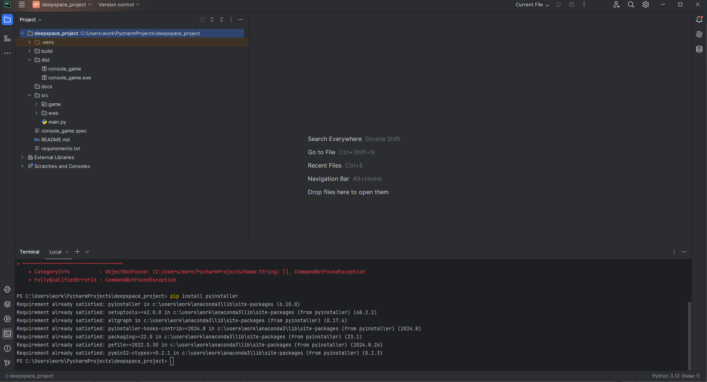
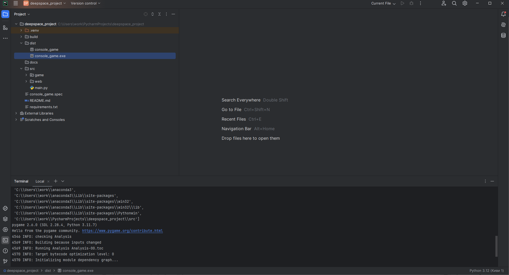
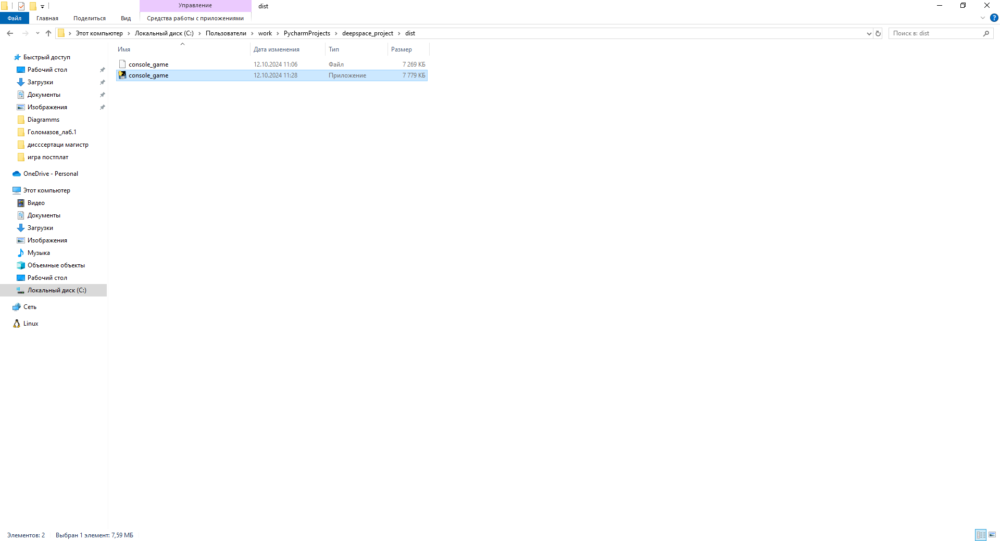
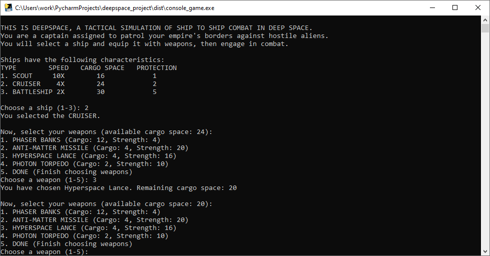
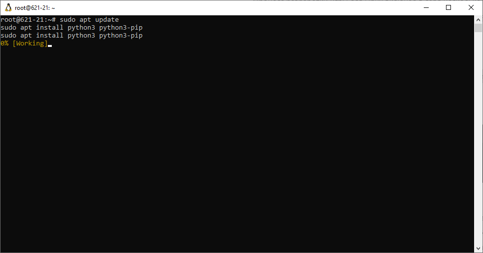
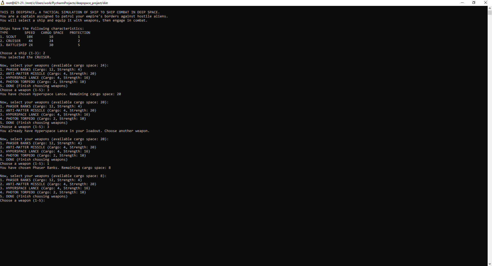
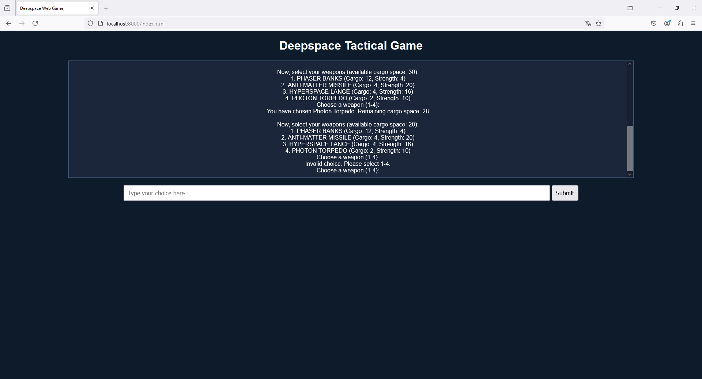

# DeepSpace Tactical Simulation

## Общее описание проекта
**Название проекта:** DeepSpace Tactical Simulation

**Описание:**
DeepSpace Tactical Simulation — это текстовая игра на Python, в которой игрок выступает в роли капитана космического корабля, патрулирующего границы своей империи. Игроку предоставляется возможность выбрать один из трёх кораблей с разными характеристиками (скорость, грузоподъёмность и защита), а также снарядить его различными видами вооружения. После выбора корабля и загрузки оружия игрок участвует в сражении с вражескими кораблями.

**Основные функции:**
- **Выбор корабля:** Игрок может выбрать один из трёх типов кораблей: Scout (разведчик), Cruiser (крейсер), Battleship (линейный корабль). Каждый из них обладает различными характеристиками, такими как скорость, грузоподъёмность и защита.
- **Снаряжение оружием:** Игрок загружает корабль различными видами оружия в зависимости от его грузоподъёмности. Каждый вид оружия занимает определённое количество места и имеет свою силу.
- **Подготовка к бою:** После выбора корабля и вооружения игрок готов к тактическому космическому бою.

## Описание команд для сборки проекта для поддерживаемых платформ

Этот проект написан на Python и не требует предварительной компиляции. Для его работы необходимо наличие интерпретатора Python версии 3.6 и выше.

### Шаги для запуска игры на различных платформах:
## 1 РАЗРАБОТКА ДЛЯ WINDOWS

Процесс разработки игры на Python для различных платформ (Windows, Linux и Web) включал в себя несколько ключевых этапов, начиная с проектирования и программирования игры и заканчивая сборкой и адаптацией для разных операционных систем. Вот поэтапное описание процесса:
1. Идея и проектирование игры
Изначально была сформирована идея тактической игры под названием Deepspace Tactical Game. Основная концепция игры заключалась в том, что игрок выступает в роли капитана космического корабля и участвует в сражениях с враждебными инопланетными кораблями. Игрок выбирает корабль, оружие и вступает в бой.
2. Разработка основной логики игры на Python
Игра была разработана на Python, и её основной игровой процесс заключался в следующем:
- Выбор корабля с определенными характеристиками (скорость, грузоподъемность и защита).
- Выбор оружия в зависимости от доступного места на корабле.
- Сражение с вражеским кораблем, включая расчеты урона и защиту.
- Отображение победы или поражения после завершения боя.
3. Вся игровая логика была реализована в виде консольного приложения на Python и хранится в папке src/game/console_game.py.
4. Для сборки игры на Windows использовался инструмент PyInstaller, который позволяет создать исполняемый файл (.exe) из Python-скрипта. Процесс включал следующие шаги:
- pip install pyinstaller

- После установки, производим компиляцию в .exe
pyinstaller --onefile src/game/console_game.py

- В указанной папке dist появляетя файл

- Ниже показан результат работы программы на Windows


## 2 РАЗРАБОТКА ДЛЯ LINUX

Процесс разработки игры для Linux включал в себя несколько шагов, начиная с подготовки среды, установки необходимых инструментов и до сборки игры в исполняемый файл для Linux.
1. Подг отовка среды разработки
Установка Python и pip
Мы начали с установки Python и pip в Linux, так как они являются основными инструментами для разработки и установки необходимых зависимостей.
Выполнили следующие команды для установки Python и pip:
 

2. Разработка кода игры
-Мы использовали тот же код, что и для Windows, но адаптировали его для консольной версии на Linux. Весь основной функционал игры, включая выбор корабля, оружия, сражение и завершение игры, был реализован с помощью стандартного Python. Это позволило запускать игру в терминале без необходимости в дополнительных зависимостях.
3. Тестирование игры на Linux
-Для проверки работоспособности игры на Linux мы просто запускали основной скрипт игры в терминале:
python3 src/game/console_game.py
4. Создание исполняемого файла для Linux
-Чтобы пользователи могли запускать игру без необходимости запускать её через Python, мы использовали PyInstaller для создания исполняемого файла. PyInstaller упаковывает игру вместе со всеми необходимыми зависимостями, чтобы можно было запускать её как самостоятельное приложение.
-Установка PyInstaller:
pip3 install pyinstaller
-Сборка игры в исполняемый файл:
После установки PyInstaller мы создали исполняемый файл:
pyinstaller --onefile src/game/console_game.py
Этот процесс создал один исполняемый файл в папке dist, который можно запустить в любой среде Linux:
./dist/console_game
5. Проверка работы исполняемого файла
После создания исполняемого файла мы протестировали его на целевой системе, чтобы убедиться, что игра работает корректно без необходимости в дополнительных установках Python или зависимостей.
./dist/console_game
6. Заключение
В процессе разработки игры на Linux мы использовали стандартные инструменты:
-Python для разработки и тестирования,
-PyInstaller для создания исполняемого файла.
7/ Игра запускается в терминале и не требует сложных графических интерфейсов, что делает её идеальной для запуска на различных дистрибутивах Linux.
-Ниже показан результат работы программы на Linux.


## 3 РАЗРАБОТКА ДЛЯ WEB

Чтобы создать веб-версию нашей игры «Deepspace Tactical Game», мы внесли несколько изменений в структуру проекта, адаптировав игру для запуска в браузере с помощью Brython — интерпретатора Python для веб-приложений. Вот основные шаги, которые были выполнены для создания веб-версии игры:
-Шаги по разработке веб-версии:
--Использование Brython:
Мы подключили Brython для выполнения Python-кода в браузере, добавив в HTML-файл ссылку на библиотеку Brython:
<script type="text/javascript" src="https://cdn.jsdelivr.net/npm/brython@3.9.5/brython.min.js"></script>
HTML-шаблон:
Создан основной HTML-файл, который содержит:
Титул игры.
Блок с "консолью" для вывода текста.
Поле для ввода пользовательских данных и кнопку для отправки.
Этот HTML также инициализирует Brython при загрузке страницы:
<body onload="brython()">

Перенос логики игры на веб:
Код игры был переписан для работы в браузере с использованием методов Brython для взаимодействия с HTML-элементами.
Логика игры осталась прежней, но добавлена функция print_text(), которая выводит текст в специальную «консоль» на веб-странице:
python
- Копировать код:

       def print_text(text):
       onsole = document["console"]
       console.innerHTML += text + "<br>"
       console.scrollTop = console.scrollHeight  # Автопрокрутка вниз

- Обработка ввода пользователя:
Вместо обычного ввода в Python с помощью input() мы реализовали функцию get_input(), которая захватывает текст из текстового поля на странице и вызывает соответствующие функции в зависимости от действия пользователя:
python
- Копировать код: 
``` Ruby
 def get_input(prompt_text, callback):
 print_text(prompt_text)
 input_field = document["user_input"]
 submit_button = document["submit_button"]
 def on_submit(event):
 user_input = input_field.value.strip()
 input_field.value = ""  # Очищаем поле ввода
 submit_button.unbind("click", on_submit)  # Убираем событие для кнопки
 callback(user_input)  # Передача пользовательского ввода в обработчик
 submit_button.bind("click", on_submit)
```
- Выбор корабля и оружия:
- Логика выбора корабля и оружия была сохранена из консольной версии. Мы добавили обновления, чтобы эти процессы работали через интерфейс веб-страницы.
- Выбор оружия и переход к битве были адаптированы для веба.
- Цикл битвы:
- Как и в консольной версии, игрок и противник обмениваются ударами, а результат боя выводится на экран в текстовом виде.
- Запуск игры:
Игра запускается при загрузке страницы с помощью функции game_intro(), которая выводит начальную информацию на экран и запускает игровой процесс.
-Мы успешно адаптировали игру для веб-среды, сохранив основную логику и функциональность. Brython позволил нам использовать Python в браузере, и игра теперь взаимодействует с пользователем через веб-интерфейс, предоставляя опыт, аналогичный консольной версии.
Результат работы представлен ниже:

